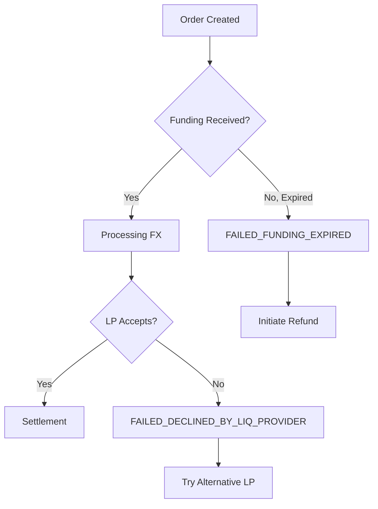

<Note>
  This is a placeholder guide demonstrating how we would document failure
  scenarios and recovery strategies.
</Note>

## Overview

Not every order succeeds. Learn how to handle the various failure states in the Stable Sea Terminal API and implement robust error recovery strategies.

<Warning>
  Proper error handling is critical for production systems. Always implement
  retry logic and graceful degradation.
</Warning>

## Common Failure Scenarios

<Steps>
  <Step title="Funding Timeout" icon="clock-x">
    **Status:** `FAILED_FUNDING_EXPIRED`
    
    The most common failure occurs when blockchain congestion delays funding past the quote expiration.

    ```javascript
    // Example: Order created but funding arrives too late
    const order = await createOrder(quote); // Success
    // Customer sends funds...
    // ⚠️ Network congestion delays transaction
    // Quote expires at funding_expires_at timestamp
    // Order moves to FAILED_FUNDING_EXPIRED
    ```

    <Accordion title="Recovery Strategy">
      **Option 1: Automatic Retry**
      ```javascript
      if (order.status === 'FAILED_FUNDING_EXPIRED') {
        // Get new quote with same parameters
        const newQuote = await retryWithNewQuote(order);
        // Redirect user to fund new quote
      }
      ```

      **Option 2: Refund Process**
      ```javascript
      // Request refund for expired order
      await requestRefund(order.id, {
        reason: 'funding_expired',
        refund_address: customer.wallet_address
      });
      ```
    </Accordion>

  </Step>

  <Step title="Liquidity Provider Decline" icon="x-circle">
    **Status:** `FAILED_DECLINED_BY_LIQ_PROVIDER`
    
    Rare but possible when liquidity providers decline orders due to risk factors.

    ```javascript
    // Handling LP decline
    if (order.status === 'FAILED_DECLINED_BY_LIQ_PROVIDER') {
      // Try alternative offering
      const alternativeOfferings = await getAlternativeOfferings({
        payin_currency: order.payin.currency,
        payout_currency: order.payout.currency
      });
    }
    ```

  </Step>

  <Step title="Customer Requested Refund" icon="arrow-left">
    **Status:** `FAILED_REFUND_REQUESTED` → `FAILED_REFUND_PROCESSED`
    
    Customer-initiated cancellations before execution begins.

    ```javascript
    // Check if refund is possible
    if (['STEP_1_AWAITING_FUNDING', 'STEP_2_FILLING_FX'].includes(order.status)) {
      await requestRefund(order.id);
    }
    ```

  </Step>
</Steps>

## Failure Flow Diagram

<Note>
  In a real guide, we would include a visual flowchart showing the decision tree
  for different failure scenarios and recovery paths.
</Note>



## Implementation Examples

### Robust Error Handling

<CodeGroup>
```javascript Node.js
class OrderProcessor {
  async processOrder(orderData, maxRetries = 3) {
    for (let attempt = 1; attempt <= maxRetries; attempt++) {
      try {
        const order = await this.createOrder(orderData);
        return await this.monitorOrderToCompletion(order);
      } catch (error) {
        if (this.isRetryableError(error) && attempt < maxRetries) {
          await this.backoff(attempt);
          continue;
        }
        throw error;
      }
    }
  }

isRetryableError(error) {
return [
'FAILED_FUNDING_EXPIRED',
'FAILED_DECLINED_BY_LIQ_PROVIDER'
].includes(error.code);
}
}

````

```python Python
class OrderProcessor:
    def process_order_with_fallback(self, order_data):
        try:
            order = self.create_order(order_data)
            return self.monitor_order(order)
        except FundingExpiredError:
            return self.retry_with_new_quote(order_data)
        except LiquidityProviderDeclineError:
            return self.try_alternative_offering(order_data)
        except Exception as e:
            self.log_error(e)
            raise
````

</CodeGroup>

### Webhook Event Handling

```javascript
// Handle failure webhooks
app.post('/webhooks/orders', (req, res) => {
  const { order, event_type } = req.body;

  switch (order.status) {
    case 'FAILED_FUNDING_EXPIRED':
      await handleFundingTimeout(order);
      break;
    case 'FAILED_DECLINED_BY_LIQ_PROVIDER':
      await handleLiquidityDecline(order);
      break;
    case 'FAILED_REFUND_PROCESSED':
      await notifyCustomerRefund(order);
      break;
  }

  res.status(200).send('OK');
});
```

## Monitoring & Alerting

<CardGroup cols={2}>
  <Card title="Failure Rate Monitoring" icon="chart-line">
    Track failure rates by type to identify systemic issues and optimize retry
    strategies.
  </Card>

{" "}
<Card title="Alert Thresholds" icon="bell">
  Set up alerts when failure rates exceed normal thresholds (e.g., >5% funding
  timeouts).
</Card>

{" "}
<Card title="Customer Communication" icon="message-circle">
  Implement clear customer messaging for each failure type with next steps.
</Card>

  <Card title="Operational Dashboards" icon="monitor">
    Build dashboards to track order success rates and failure recovery
    effectiveness.
  </Card>
</CardGroup>

## Testing Failure Scenarios

<Tip>
  In a complete guide, we would provide sandbox endpoints to simulate different
  failure conditions for testing your error handling logic.
</Tip>

```javascript
// Simulate failures in sandbox environment
const testOrder = await fetch("/api/orders", {
  method: "POST",
  headers: { "X-Test-Scenario": "FUNDING_TIMEOUT" },
  body: JSON.stringify(orderData),
});
```
